# AI智学助手——智能教学辅助系统

## 一、项目简介

AI智学助手是一款面向教师和学生的桌面端智能教学辅助系统。项目采用 **Spring Boot 后端 + JavaFX 桌面客户端 + MySQL 数据库 + 千问大模型 API** 的技术架构，围绕课程建设、章节小节学习、学习任务发布、题目管理、AI 自动生成题目、学生在线答题、错题本、学习进度统计、学生学习报告和班级学习分析等功能展开。

本项目的核心目标是构建一个较完整的教学辅助闭环：

```text
教师创建课程
    ↓
教师维护章节、小节、知识点
    ↓
教师创建题目或使用 AI 生成题目
    ↓
教师发布学习任务
    ↓
学生加入课程并完成学习
    ↓
学生在线答题并提交记录
    ↓
系统记录学习进度、答题情况和错题数据
    ↓
生成个人学习报告与班级学习报告
    ↓
根据错题和薄弱知识点生成个性化复习题
```

项目适用于课程学习管理、教师辅助出题、学生个性化复习、学习过程跟踪、教学数据统计和教学成果展示等场景。

---

## 二、项目特点

- 采用前后端分离架构，后端负责数据与业务逻辑，JavaFX 客户端负责桌面端交互。
- 支持教师端和学生端两类角色，登录后自动进入不同功能界面。
- 支持课程、章节、小节三级学习内容管理。
- 支持学生加入课程并记录小节学习进度。
- 支持教师创建题目、发布学习任务、查看答题统计。
- 支持学生完成学习任务、提交答案、查看错题本。
- 支持个人学习报告和班级学习报告。
- 接入千问大模型 API，可根据知识点自动生成练习题。
- 支持根据学生错题数据生成相同知识点的个性化复习题。
- 项目结构清晰，便于继续扩展为多人联网版本或正式教学平台。

---

## 三、项目技术栈

### 1. 后端技术

| 技术 | 说明 |
|---|---|
| Java 17 | 后端主要开发语言 |
| Spring Boot 3.5.9 | 后端主框架 |
| Spring Web | 提供 RESTful API 接口 |
| MySQL | 关系型数据库，用于保存用户、课程、题目、任务、答题记录等数据 |
| MyBatis-Plus 3.5.16 | 数据访问层框架，简化 CRUD 操作 |
| Maven | 项目构建与依赖管理 |
| Lombok | 简化实体类、Getter、Setter 等代码 |
| Spring Security Crypto | 使用 BCrypt 进行密码加密 |
| Validation | 参数校验 |
| Java HttpClient | 后端调用千问大模型 API |

### 2. 客户端技术

| 技术 | 说明 |
|---|---|
| Java 17 | 客户端主要开发语言 |
| JavaFX 17.0.6 | 桌面端 UI 框架 |
| Maven | 客户端构建工具 |
| Jackson 2.17.2 | JSON 序列化和反序列化 |
| Java HttpClient | 客户端调用后端接口 |

### 3. AI 能力

| 技术 / 平台 | 说明 |
|---|---|
| 阿里云百炼 DashScope | 大模型 API 服务 |
| qwen-plus | 当前项目中使用的模型名称 |
| DASHSCOPE_API_KEY | 后端通过环境变量读取 API Key |

### 4. 开发工具

| 工具 | 说明 |
|---|---|
| IntelliJ IDEA | Java 后端与 JavaFX 客户端开发 |
| MySQL Workbench | 数据库管理 |
| Apifox | 后端接口测试 |
| Git / GitHub | 版本管理和项目托管 |
| Maven Wrapper | 项目自带 Maven 启动脚本 |

---

## 四、项目目录结构

```text
desktop-app
├─ README.md
├─ learning-assistant-backend
│  ├─ pom.xml
│  ├─ mvnw
│  ├─ mvnw.cmd
│  ├─ test.http
│  ├─ test-course.http
│  └─ src
│     ├─ main
│     │  ├─ java/com/scms/learning
│     │  │  ├─ LearningAssistantBackendApplication.java
│     │  │  ├─ common
│     │  │  │  └─ Result.java
│     │  │  ├─ config
│     │  │  │  ├─ MyBatisPlusConfig.java
│     │  │  │  └─ WebConfig.java
│     │  │  ├─ controller
│     │  │  ├─ dto
│     │  │  ├─ entity
│     │  │  ├─ exception
│     │  │  ├─ mapper
│     │  │  ├─ service
│     │  │  └─ vo
│     │  └─ resources
│     │     └─ application.yml
│     └─ test
│
└─ learning-assistant-client
   ├─ pom.xml
   ├─ mvnw
   ├─ mvnw.cmd
   └─ src
      ├─ main
      │  ├─ java/com/scms/learningassistantclient
      │  │  ├─ HelloApplication.java
      │  │  ├─ Launcher.java
      │  │  ├─ api
      │  │  ├─ config
      │  │  ├─ model
      │  │  ├─ util
      │  │  └─ view
      │  └─ resources
      │     └─ com/scms/learningassistantclient/hello-view.fxml
      └─ test
```

---

## 五、后端模块说明

后端项目路径：

```text
learning-assistant-backend
```

### 1. common

通用返回结果封装。

主要文件：

```text
Result.java
```

用于统一后端接口返回格式，包含：

```text
code        状态码
message     返回消息
data        返回数据
```

### 2. config

后端配置模块。

主要文件：

```text
MyBatisPlusConfig.java
WebConfig.java
```

功能说明：

- 配置 MyBatis-Plus 分页插件等内容。
- 配置跨域访问，方便 JavaFX 客户端或接口测试工具访问后端接口。

### 3. controller

控制层，负责接收客户端请求并返回数据。

当前项目包含的主要控制器：

```text
AiQuestionController.java
AnswerController.java
AuthController.java
ChapterController.java
ClassReportController.java
CourseController.java
HealthController.java
KnowledgePointController.java
QuestionController.java
ReportController.java
ReviewTaskController.java
SectionController.java
StudyProgressController.java
TaskController.java
TaskQuestionController.java
WrongQuestionController.java
```

### 4. dto

请求参数对象，用于接收前端传来的数据。

主要包含：

```text
AiGenerateQuestionRequest.java
ChapterCreateRequest.java
CreateCourseRequest.java
JoinCourseRequest.java
LoginRequest.java
RegisterRequest.java
ReviewTaskGenerateRequest.java
SectionCreateRequest.java
StudyProgressRequest.java
```

### 5. entity

数据库实体类，与 MySQL 表结构对应。

主要包含：

```text
User.java
Course.java
Chapter.java
Section.java
CourseMember.java
StudyProgress.java
KnowledgePoint.java
Question.java
LearningTask.java
LearningTaskQuestion.java
AnswerRecord.java
WrongQuestion.java
```

### 6. mapper

MyBatis-Plus 数据访问接口。

主要包含：

```text
UserMapper.java
CourseMapper.java
ChapterMapper.java
SectionMapper.java
CourseMemberMapper.java
StudyProgressMapper.java
KnowledgePointMapper.java
QuestionMapper.java
LearningTaskMapper.java
LearningTaskQuestionMapper.java
AnswerRecordMapper.java
WrongQuestionMapper.java
```

### 7. service

业务层，负责处理核心业务逻辑。

主要包含：

```text
AuthService.java
CourseService.java
ChapterService.java
SectionService.java
StudyProgressService.java
AiQuestionService.java
```

其中 `AiQuestionService` 负责调用千问大模型 API，完成 AI 生成题目和基于错题的个性化复习题生成功能。

### 8. vo

前端展示对象，用于返回更适合客户端展示的数据。

主要包含：

```text
LoginUserVO.java
CourseVO.java
StudentProgressSummaryVO.java
StudyProgressDetailVO.java
StudentReportVO.java
ClassLearningReportVO.java
ClassStudentReportVO.java
KnowledgePointStatVO.java
AnswerRecordDetailVO.java
```

---

## 六、客户端模块说明

客户端项目路径：

```text
learning-assistant-client
```

### 1. api

客户端接口调用层，封装对后端接口的请求。

主要包含：

```text
AiQuestionApi.java
AnswerApi.java
AuthApi.java
ChapterApi.java
ClassReportApi.java
CourseApi.java
QuestionApi.java
ReportApi.java
ReviewTaskApi.java
SectionApi.java
StudyProgressApi.java
TaskApi.java
TaskQuestionApi.java
WrongQuestionApi.java
```

### 2. config

客户端配置模块。

主要文件：

```text
AppConfig.java
```

当前后端地址配置为：

```java
public static final String BASE_URL = "http://localhost:8080";
```

如果需要连接局域网中其他电脑上的后端服务，可以修改为：

```java
public static final String BASE_URL = "http://后端电脑IP地址:8080";
```

例如：

```java
public static final String BASE_URL = "http://192.168.1.8:8080";
```

如果使用 cpolar 等内网穿透工具，也可以修改为公网访问地址。

### 3. model

客户端数据模型，与后端返回数据对应。

主要包含：

```text
LoginRequest.java
RegisterRequest.java
LoginUser.java
Course.java
CourseChapter.java
CourseSection.java
Question.java
LearningTask.java
LearningTaskQuestion.java
AnswerRecord.java
WrongQuestion.java
StudentReport.java
ClassLearningReport.java
KnowledgePointStat.java
ApiResponse.java
```

### 4. util

工具类模块。

主要文件：

```text
ApiClient.java
AppContext.java
```

说明：

- `ApiClient`：统一封装 GET、POST 等网络请求。
- `AppContext`：保存当前登录用户信息，便于页面之间共享登录状态。

### 5. view

JavaFX 页面模块。

主要页面包括：

```text
LoginView.java
RegisterView.java
TeacherHomeView.java
TeacherCourseView.java
TeacherCourseDetailView.java
TeacherChapterDetailView.java
TeacherQuestionView.java
TeacherTaskView.java
TeacherAnswerStatsView.java
TeacherProgressView.java
TeacherClassReportView.java
StudentHomeView.java
StudentCourseView.java
StudentCourseDetailView.java
StudentChapterDetailView.java
StudentQuizView.java
StudentWrongBookView.java
StudentLearningReportView.java
```

---

## 七、核心功能说明

## 1. 用户登录与注册模块

系统支持教师和学生两类用户。

### 教师角色

教师登录后可以进入教师端首页，使用课程管理、章节管理、小节管理、题目管理、任务发布、学生进度查看和班级报告等功能。

### 学生角色

学生登录后可以进入学生端首页，使用加入课程、学习小节、完成任务、在线答题、查看错题本和查看学习报告等功能。

### 已实现功能

- 用户注册
- 用户登录
- 教师 / 学生角色区分
- BCrypt 密码加密
- 登录后跳转到对应角色首页
- 客户端保存当前登录用户信息

---

## 2. 课程管理模块

课程是系统中的核心学习单位。

### 教师端功能

- 创建课程
- 查看自己创建的课程
- 进入课程详情
- 管理课程章节
- 查看加入课程的学生
- 查看课程学习进度统计

### 学生端功能

- 查看课程
- 加入课程
- 查看自己已加入的课程
- 进入课程进行学习

### 课程数据字段

```text
id              课程ID
courseName      课程名称
description     课程描述
teacherId       教师ID
teacherName     教师姓名
className       班级名称
createTime      创建时间
```

---

## 3. 章节与小节管理模块

课程下可以创建多个章节，章节下可以创建多个小节。

### 章节功能

- 教师创建章节
- 教师查看章节列表
- 按排序字段展示章节
- 学生查看课程章节

### 小节功能

- 教师创建小节
- 教师维护小节内容
- 教师设置小节知识点
- 学生查看小节内容
- 学生完成小节学习

### 小节数据字段

```text
id                  小节ID
chapterId           所属章节ID
sectionTitle        小节标题
content             小节内容
knowledgePoints     知识点
sortOrder           排序序号
```

---

## 4. 学习进度模块

学生完成小节学习后，系统会记录学习进度。

### 功能说明

- 学生标记小节完成
- 系统保存课程、章节、小节、学生之间的学习关系
- 教师查看课程下所有学生学习情况
- 教师查看单个学生课程学习详情
- 学生查看自己的学习进度

### 学习进度数据字段

```text
id                  进度ID
courseId            课程ID
chapterId           章节ID
sectionId           小节ID
studentId           学生ID
status              学习状态
progressPercent     学习百分比
updateTime          更新时间
```

---

## 5. 知识点模块

系统支持按小节维护知识点。

### 功能说明

- 创建知识点
- 查询小节下的知识点
- 删除知识点
- 标记重点知识点
- 标记易错知识点
- 设置知识点难度

### 知识点数据字段

```text
id              知识点ID
sectionId       所属小节ID
pointName       知识点名称
description     知识点描述
difficulty      难度
isKeyPoint      是否重点
isEasyWrong     是否易错
createTime      创建时间
```

---

## 6. 题目管理模块

教师可以创建题目，也可以通过 AI 生成题目。

### 功能说明

- 新增题目
- 查询课程题目
- 删除题目
- 设置题目类型
- 设置题干、选项、答案和解析
- 绑定课程、章节、小节和知识点
- 设置题目难度

### 题目数据字段

```text
id                  题目ID
courseId            课程ID
chapterId           章节ID
sectionId           小节ID
questionType        题目类型
questionText        题干
options             选项
answer              标准答案
analysis            答案解析
knowledgePoint      知识点名称
knowledgePointId    知识点ID
difficulty          难度
createTime          创建时间
```

---

## 7. AI 生成题目模块

本项目已接入千问大模型 API。

### 功能说明

教师可以输入课程、章节、小节、知识点、题目类型、难度和数量，系统调用 AI 接口生成题目，并将生成结果保存到题库中。

当前使用的模型：

```text
qwen-plus
```

AI 接口地址：

```text
https://dashscope.aliyuncs.com/compatible-mode/v1/chat/completions
```

后端从环境变量读取 API Key：

```text
DASHSCOPE_API_KEY
```

### 请求接口

```text
POST /api/ai/questions/generate
```

### 请求示例

```json
{
  "courseId": 1,
  "chapterId": 1,
  "sectionId": 1,
  "knowledgePoint": "概率的基本性质",
  "questionType": "single",
  "difficulty": "normal",
  "count": 5
}
```

---

## 8. 学习任务模块

教师可以创建学习任务，并将题目添加到任务中。

### 功能说明

- 创建学习任务
- 查询课程下的学习任务
- 删除学习任务
- 绑定任务题目
- 学生查看任务并答题

### 学习任务数据字段

```text
id              任务ID
courseId        课程ID
chapterId       章节ID
sectionId       小节ID
teacherId       教师ID
taskTitle       任务标题
description     任务描述
status          任务状态
taskType        任务类型
startTime       开始时间
endTime         结束时间
createTime      创建时间
```

---

## 9. 在线答题模块

学生可以进入任务完成答题，系统保存答题记录。

### 功能说明

- 学生进入任务答题页面
- 展示题目内容、选项和题干
- 学生提交答案
- 系统判断是否正确
- 保存答题记录
- 教师查看任务答题统计
- 学生查看自己的答题记录

### 答题记录数据字段

```text
id                  答题记录ID
taskId              任务ID
questionId          题目ID
studentId           学生ID
studentAnswer       学生答案
courseId            课程ID
chapterId           章节ID
sectionId           小节ID
knowledgePointId    知识点ID
answerDuration      答题用时
isCorrect           是否正确
score               得分
submitTime          提交时间
```

---

## 10. 错题本模块

当学生答错题目后，系统会保存错题记录，形成个人错题本。

### 功能说明

- 查看学生错题
- 按课程查看错题
- 记录错题对应知识点
- 记录错误次数
- 标记错题已掌握
- 删除错题
- 为个性化复习提供数据基础

### 错题数据字段

```text
id                  错题ID
studentId           学生ID
questionId          题目ID
courseId            课程ID
chapterId           章节ID
sectionId           小节ID
knowledgePointId    知识点ID
knowledgePointName  知识点名称
wrongCount          错误次数
lastWrongTime       最近错误时间
isMastered          是否已掌握
createTime          创建时间
updateTime          更新时间
```

---

## 11. 个人学习报告模块

学生可以查看自己的学习报告。

### 功能说明

- 学习进度统计
- 答题数量统计
- 正确率统计
- 错题数量统计
- 薄弱知识点统计
- 学习建议展示

### 接口示例

```text
GET /api/reports/student/{studentId}/course/{courseId}
```

---

## 12. 班级学习报告模块

教师可以查看课程维度下的班级学习报告。

### 功能说明

- 班级学生数量统计
- 学生平均正确率统计
- 学生答题数量统计
- 学生错题数量统计
- 班级薄弱知识点分析
- 学生学习情况列表

### 接口示例

```text
GET /api/class-report/course/{courseId}
```

---

## 13. 个性化复习模块

系统支持根据学生错题本生成同知识点、相似考法的新复习题。

### 功能说明

- 读取学生错题记录
- 提取薄弱知识点
- 调用 AI 生成相同知识点的新题目
- 保存生成后的题目
- 学生可进行针对性复习

### 接口示例

```text
POST /api/review-tasks/generate
```

---

## 八、主要接口说明

### 1. 用户接口

| 请求方式 | 接口地址 | 说明 |
|---|---|---|
| POST | `/api/auth/register` | 用户注册 |
| POST | `/api/auth/login` | 用户登录 |

### 2. 健康检查接口

| 请求方式 | 接口地址 | 说明 |
|---|---|---|
| GET | `/` | 项目根路径检查 |
| GET | `/api/health` | 后端健康检查 |

### 3. 课程接口

| 请求方式 | 接口地址 | 说明 |
|---|---|---|
| POST | `/api/courses/create` | 创建课程 |
| GET | `/api/courses/list` | 查询课程列表 |
| GET | `/api/courses/teacher/{teacherId}` | 查询教师创建的课程 |
| POST | `/api/courses/join` | 学生加入课程 |
| GET | `/api/courses/my/{studentId}` | 查询学生加入的课程 |

### 4. 章节接口

| 请求方式 | 接口地址 | 说明 |
|---|---|---|
| GET | `/api/courses/{courseId}/chapters` | 查询课程章节 |
| POST | `/api/courses/{courseId}/chapters` | 创建章节 |

### 5. 小节接口

| 请求方式 | 接口地址 | 说明 |
|---|---|---|
| GET | `/api/chapters/{chapterId}/sections` | 查询章节小节 |
| POST | `/api/chapters/{chapterId}/sections` | 创建小节 |

### 6. 学习进度接口

| 请求方式 | 接口地址 | 说明 |
|---|---|---|
| POST | `/api/study-progress/section` | 标记小节学习进度 |
| GET | `/api/study-progress/course/{courseId}/summary` | 查看课程学习进度汇总 |
| GET | `/api/study-progress/student/{studentId}/course/{courseId}` | 查看学生课程学习详情 |

### 7. 知识点接口

| 请求方式 | 接口地址 | 说明 |
|---|---|---|
| POST | `/api/knowledge-points` | 创建知识点 |
| GET | `/api/knowledge-points/section/{sectionId}` | 查询小节知识点 |
| DELETE | `/api/knowledge-points/{id}` | 删除知识点 |

### 8. 题目接口

| 请求方式 | 接口地址 | 说明 |
|---|---|---|
| POST | `/api/questions` | 创建题目 |
| GET | `/api/questions/course/{courseId}` | 查询课程题目 |
| DELETE | `/api/questions/{id}` | 删除题目 |

### 9. AI 生成题目接口

| 请求方式 | 接口地址 | 说明 |
|---|---|---|
| POST | `/api/ai/questions/generate` | AI 生成题目并保存 |

### 10. 学习任务接口

| 请求方式 | 接口地址 | 说明 |
|---|---|---|
| POST | `/api/tasks` | 创建学习任务 |
| GET | `/api/tasks/course/{courseId}` | 查询课程任务 |
| DELETE | `/api/tasks/{id}` | 删除学习任务 |

### 11. 任务题目接口

| 请求方式 | 接口地址 | 说明 |
|---|---|---|
| POST | `/api/task-questions` | 添加任务题目 |
| GET | `/api/task-questions/task/{taskId}` | 查询任务题目 |
| DELETE | `/api/task-questions/task/{taskId}/question/{questionId}` | 移除任务题目 |

### 12. 答题接口

| 请求方式 | 接口地址 | 说明 |
|---|---|---|
| POST | `/api/answers/submit` | 提交答案 |
| GET | `/api/answers/task/{taskId}` | 查询任务答题记录 |
| GET | `/api/answers/task/{taskId}/detail` | 查询任务答题详情 |
| GET | `/api/answers/student/{studentId}` | 查询学生答题记录 |
| GET | `/api/answers/student/{studentId}/wrong` | 查询学生错题详情 |
| GET | `/api/answers/student/{studentId}/course/{courseId}/detail` | 查询学生某课程答题详情 |
| GET | `/api/answers/student/{studentId}/course/{courseId}/wrong` | 查询学生某课程错题详情 |

### 13. 错题接口

| 请求方式 | 接口地址 | 说明 |
|---|---|---|
| GET | `/api/wrong-questions/student/{studentId}` | 查询学生错题 |
| GET | `/api/wrong-questions/student/{studentId}/course/{courseId}` | 查询学生某课程错题 |
| PUT | `/api/wrong-questions/{id}/mastered` | 标记错题已掌握 |
| DELETE | `/api/wrong-questions/{id}` | 删除错题 |

### 14. 学习报告接口

| 请求方式 | 接口地址 | 说明 |
|---|---|---|
| GET | `/api/reports/student/{studentId}/course/{courseId}` | 查询学生个人学习报告 |
| GET | `/api/class-report/course/{courseId}` | 查询班级学习报告 |

### 15. 个性化复习接口

| 请求方式 | 接口地址 | 说明 |
|---|---|---|
| POST | `/api/review-tasks/generate` | 根据错题生成个性化复习题 |

---

## 九、数据库设计说明

项目使用 MySQL 数据库，数据库名默认为：

```sql
learning_assistant
```

后端连接配置位于：

```text
learning-assistant-backend/src/main/resources/application.yml
```

当前配置示例：

```yaml
server:
  port: 8080
  address: 0.0.0.0

spring:
  datasource:
    url: "jdbc:mysql://localhost:3306/learning_assistant?useUnicode=true&characterEncoding=utf8&serverTimezone=Asia/Shanghai&useSSL=false&allowPublicKeyRetrieval=true"
    username: root
    password: "0000"
    driver-class-name: com.mysql.cj.jdbc.Driver

mybatis-plus:
  mapper-locations: classpath:/mapper/*.xml
  type-aliases-package: com.scms.learning.entity
  configuration:
    map-underscore-to-camel-case: true
    log-impl: org.apache.ibatis.logging.stdout.StdOutImpl
```

如果本机 MySQL 密码不是 `0000`，需要修改：

```yaml
spring:
  datasource:
    username: 你的MySQL用户名
    password: "你的MySQL密码"
```

### 主要数据表

| 表名 | 说明 |
|---|---|
| `user` | 用户表，保存教师和学生信息 |
| `course` | 课程表 |
| `chapter` | 章节表 |
| `section` | 小节表 |
| `course_member` | 课程成员表，保存学生加入课程关系 |
| `study_progress` | 学习进度表 |
| `knowledge_point` | 知识点表 |
| `question` | 题目表 |
| `learning_task` | 学习任务表 |
| `learning_task_question` | 学习任务与题目关联表 |
| `answer_record` | 答题记录表 |
| `wrong_question` | 错题表 |

---

## 十、运行环境要求

### 1. 基础环境

| 环境 | 要求 |
|---|---|
| JDK | 17 或以上 |
| Maven | 3.8 或以上，项目也可使用自带 mvnw |
| MySQL | 8.0 推荐 |
| 操作系统 | Windows 10 / Windows 11 |
| IDE | IntelliJ IDEA 推荐 |

### 2. 运行前准备

需要先创建数据库：

```sql
CREATE DATABASE learning_assistant DEFAULT CHARACTER SET utf8mb4 COLLATE utf8mb4_unicode_ci;
```

然后根据项目实体类创建对应数据表。

如果使用 AI 生成功能，需要配置环境变量：

```text
DASHSCOPE_API_KEY=你的千问API Key
```

Windows 配置方式示例：

```cmd
setx DASHSCOPE_API_KEY "你的API Key"
```

配置完成后需要重新打开 IntelliJ IDEA 或命令行窗口，使环境变量生效。

---

## 十一、后端启动方式

进入后端目录：

```bash
cd learning-assistant-backend
```

使用 Maven 启动：

```bash
mvn spring-boot:run
```

如果使用项目自带 Maven Wrapper：

Windows：

```bash
mvnw.cmd spring-boot:run
```

Linux / macOS：

```bash
./mvnw spring-boot:run
```

启动成功后，默认访问地址为：

```text
http://localhost:8080
```

健康检查接口：

```text
http://localhost:8080/api/health
```

---

## 十二、客户端启动方式

进入客户端目录：

```bash
cd learning-assistant-client
```

使用 JavaFX Maven 插件启动：

```bash
mvn clean javafx:run
```

如果使用 Maven Wrapper：

Windows：

```bash
mvnw.cmd clean javafx:run
```

Linux / macOS：

```bash
./mvnw clean javafx:run
```

客户端启动后会进入登录页面。

---

## 十三、本机运行流程

推荐按照以下顺序运行：

```text
1. 启动 MySQL
2. 创建 learning_assistant 数据库
3. 修改 application.yml 中的数据库账号和密码
4. 配置 DASHSCOPE_API_KEY 环境变量（如需 AI 功能）
5. 启动 Spring Boot 后端
6. 确认 http://localhost:8080/api/health 可以访问
7. 启动 JavaFX 客户端
8. 注册教师和学生账号
9. 教师创建课程、章节、小节、题目和任务
10. 学生加入课程、学习小节并完成答题
11. 查看学习报告、错题本和班级报告
```

---

## 十四、局域网使用说明

如果需要让其他电脑连接本机后端，需要进行以下配置。

### 1. 后端监听地址

项目后端已经配置：

```yaml
server:
  address: 0.0.0.0
  port: 8080
```

表示允许局域网其他设备访问后端服务。

### 2. 查看本机 IP 地址

Windows 命令行输入：

```cmd
ipconfig
```

找到 IPv4 地址，例如：

```text
192.168.1.8
```

### 3. 修改客户端后端地址

打开客户端配置文件：

```text
learning-assistant-client/src/main/java/com/scms/learningassistantclient/config/AppConfig.java
```

将：

```java
public static final String BASE_URL = "http://localhost:8080";
```

修改为：

```java
public static final String BASE_URL = "http://192.168.1.8:8080";
```

### 4. 放行防火墙

如果其他电脑访问失败，需要在 Windows 防火墙中放行 8080 端口。

---

## 十五、外网访问说明

如果希望不同网络环境下的用户访问本机后端，可以使用 cpolar、ngrok 等内网穿透工具。

基本思路：

```text
本机 Spring Boot 后端运行在 8080 端口
    ↓
cpolar 将本机 8080 端口映射为公网地址
    ↓
JavaFX 客户端 BASE_URL 修改为 cpolar 公网地址
    ↓
其他用户通过客户端访问公网地址
```

例如：

```java
public static final String BASE_URL = "https://xxxx.cpolar.top";
```

---

## 十六、项目当前完成情况

### 已完成

- Spring Boot 后端基础架构
- JavaFX 客户端基础架构
- MySQL 数据库连接
- 用户注册与登录
- 教师 / 学生角色区分
- 教师课程管理
- 学生加入课程
- 章节管理
- 小节管理
- 学习进度记录
- 教师查看学生学习进度
- 题目管理
- 学习任务管理
- 学生在线答题
- 答题记录保存
- 错题本功能
- 学生个人学习报告
- 教师班级学习报告
- AI 生成题目
- 基于错题的个性化复习题生成
- 客户端与后端接口联调
- 支持本机运行和局域网访问配置

### 可继续完善

- 增加完整数据库初始化 SQL 文件
- 增加登录 Token 鉴权机制
- 增加管理员角色
- 增加题目批量导入导出
- 增加图表化数据展示
- 增加学习报告导出 Word / PDF 功能
- 增加客户端安装包自动打包流程
- 增加部署到云服务器的正式版本
- 增强 AI 生成题目的稳定性和格式校验
- 增加主观题智能批改功能

---

## 十七、项目创新点

### 1. 教学流程闭环化

系统不是单一的题库或课程管理工具，而是将课程建设、章节学习、任务发布、学生答题、错题记录、学习报告和复习推荐串联起来，形成较完整的教学闭环。

### 2. AI 辅助教师出题

教师只需要输入知识点、题型、难度和题目数量，系统即可调用大模型生成练习题，减少教师重复出题成本。

### 3. 基于错题的个性化复习

系统能够根据学生错题本提取薄弱知识点，再调用 AI 生成相同知识点、相似考法的新题目，使复习更有针对性。

### 4. 教师端与学生端双角色设计

系统同时考虑教师教学管理和学生自主学习需求，具备较完整的真实教学使用场景。

### 5. 桌面端应用形式

相比普通网页项目，本系统采用 JavaFX 实现桌面端客户端，能够展示 Java 桌面应用开发能力，也便于打包为可执行程序。

---

## 十八、常见问题

### 1. 后端启动失败，提示数据库连接错误

请检查：

- MySQL 是否已经启动
- 数据库 `learning_assistant` 是否已经创建
- `application.yml` 中的用户名和密码是否正确
- MySQL 端口是否为 3306

### 2. 客户端登录失败

请检查：

- 后端是否已经启动
- `AppConfig.BASE_URL` 是否正确
- 后端接口是否能访问
- 数据库中是否有对应用户

### 3. AI 生成题目失败

请检查：

- 是否配置了 `DASHSCOPE_API_KEY`
- API Key 是否正确
- 当前网络是否可以访问 DashScope 接口
- 控制台是否提示“未配置环境变量 DASHSCOPE_API_KEY”

### 4. 局域网其他电脑访问失败

请检查：

- 后端是否配置 `server.address: 0.0.0.0`
- 是否使用本机真实 IPv4 地址
- Windows 防火墙是否放行 8080 端口
- 两台电脑是否处于同一局域网

### 5. JavaFX 页面显示不完整

可以检查：

- 窗口大小是否过小
- 文本控件是否设置自动换行
- 表格列宽是否合理
- 是否需要使用 ScrollPane 包裹内容

---

## 十九、项目后续规划

后续可以从以下方向继续完善：

1. 完善数据库初始化脚本，方便其他人一键导入。
2. 增加用户 Token 鉴权，提升接口安全性。
3. 增加学习报告图表，包括正确率趋势、薄弱知识点占比等。
4. 增加教师端任务发布状态管理，例如未开始、进行中、已结束。
5. 增加学生端复习计划模块，根据错题和学习进度自动安排复习。
6. 增加 AI 主观题批改功能，提高系统智能化程度。
7. 增加课程资源上传功能，例如课件、图片、PDF 等。
8. 增加客户端打包为 exe 的完整流程，使普通用户无需安装开发环境即可运行。
9. 将后端部署到云服务器，实现真正的多人在线使用。

---

## 二十、项目运行截图建议

## 项目运行截图

### 1. 登录页面
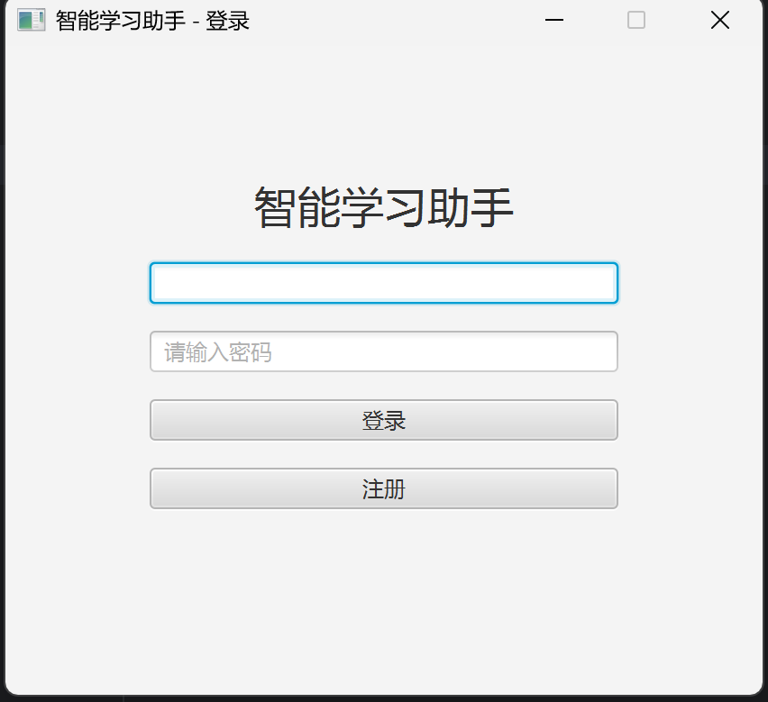

### 2. 注册页面
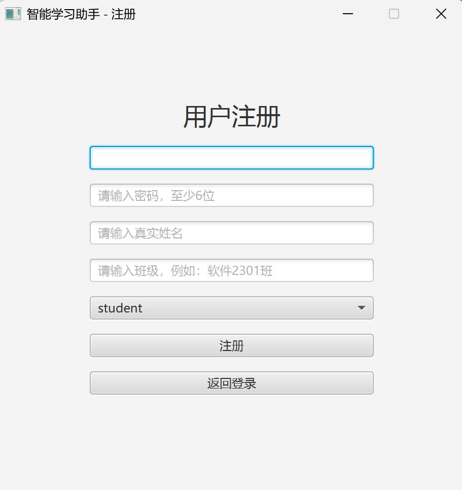

### 3. 教师端首页
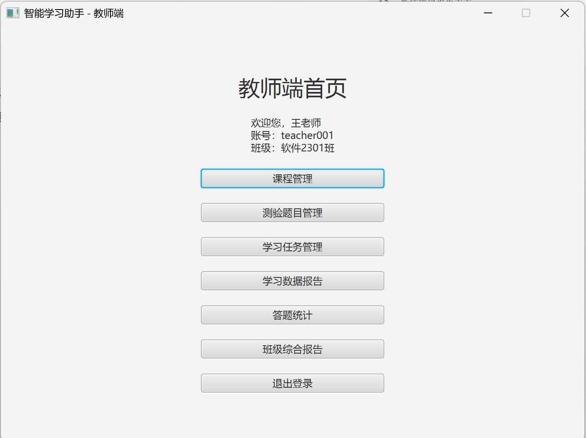

### 4. 教师课程管理页面
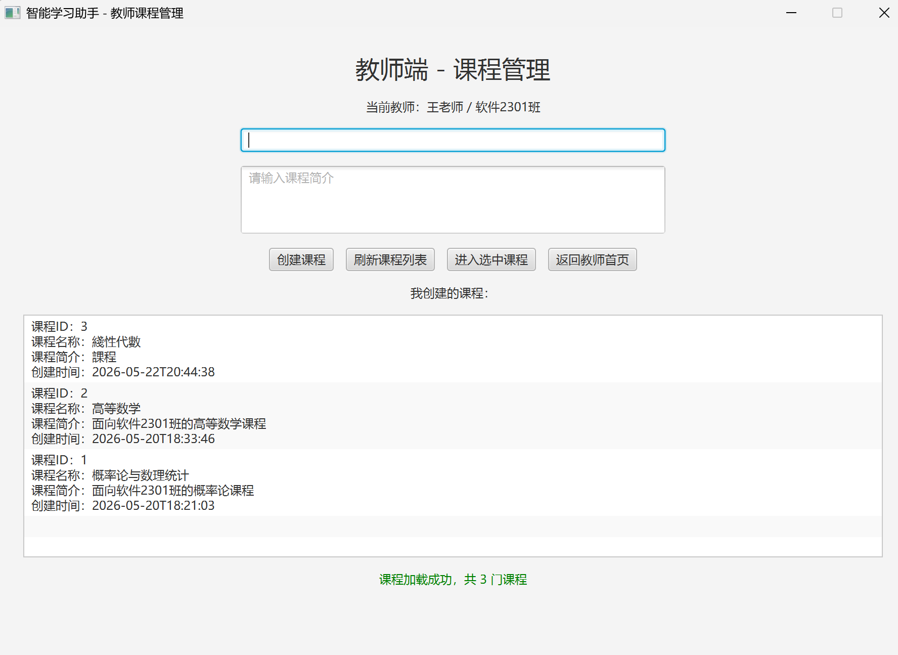

### 5. 章节小节管理页面
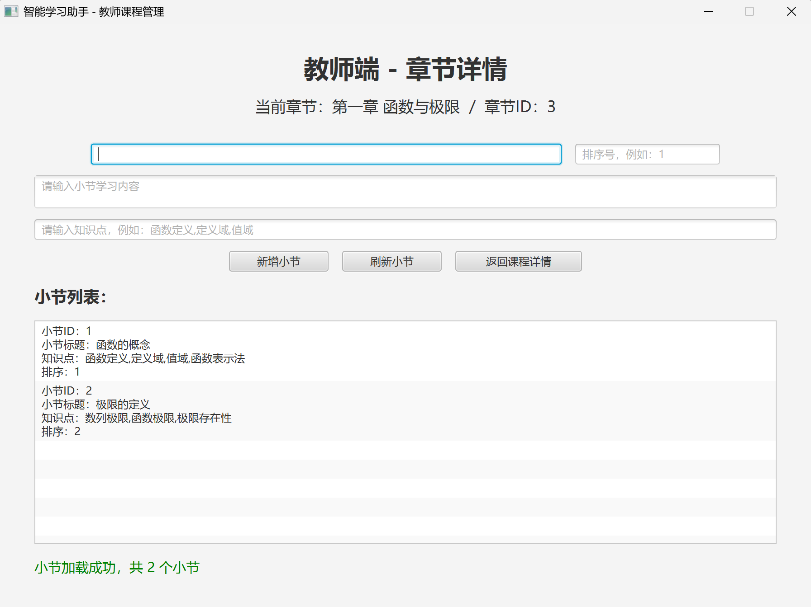

### 6. AI生成题目页面
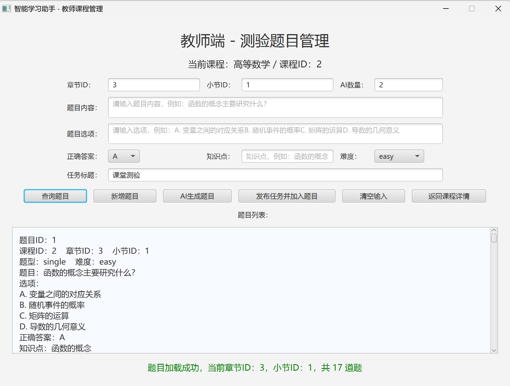

### 7. 教师任务管理页面
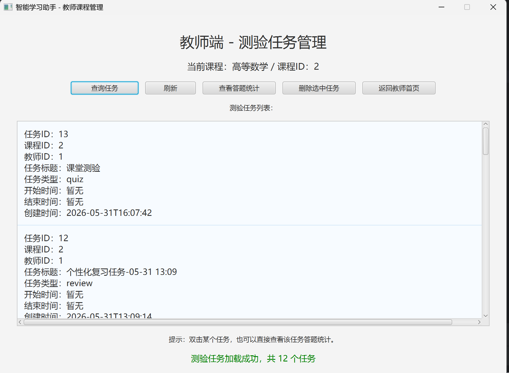

### 8. 学生端首页
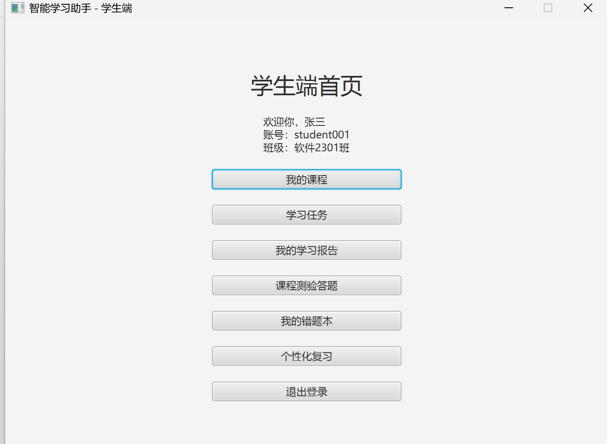

### 9. 学生课程学习页面
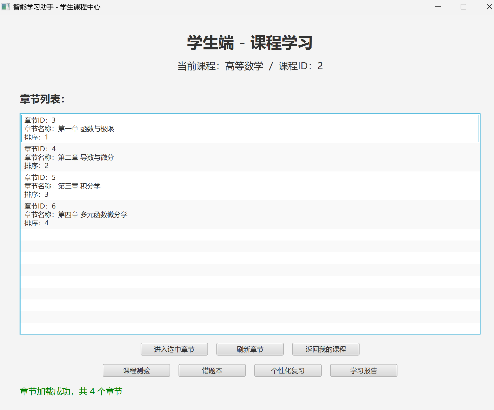

### 10. 学生答题页面
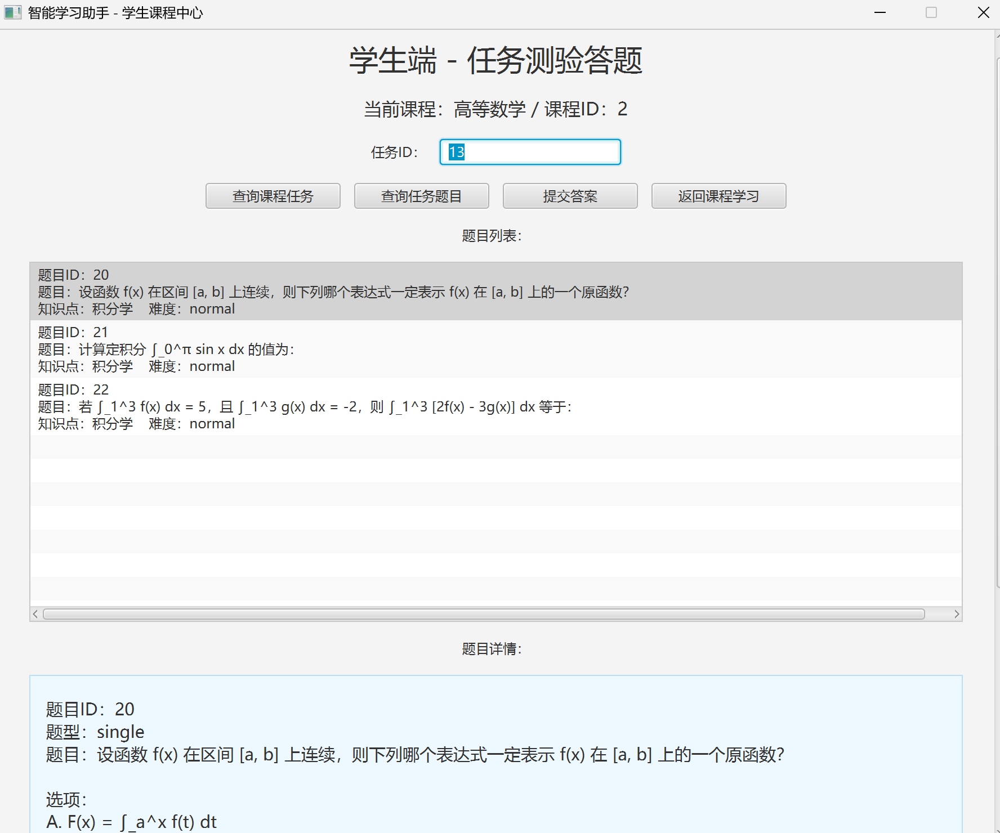

### 11. 学生错题本页面
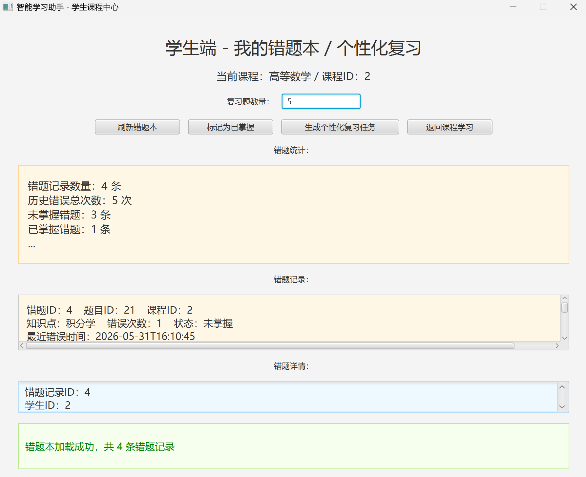

### 12. 学生学习报告页面
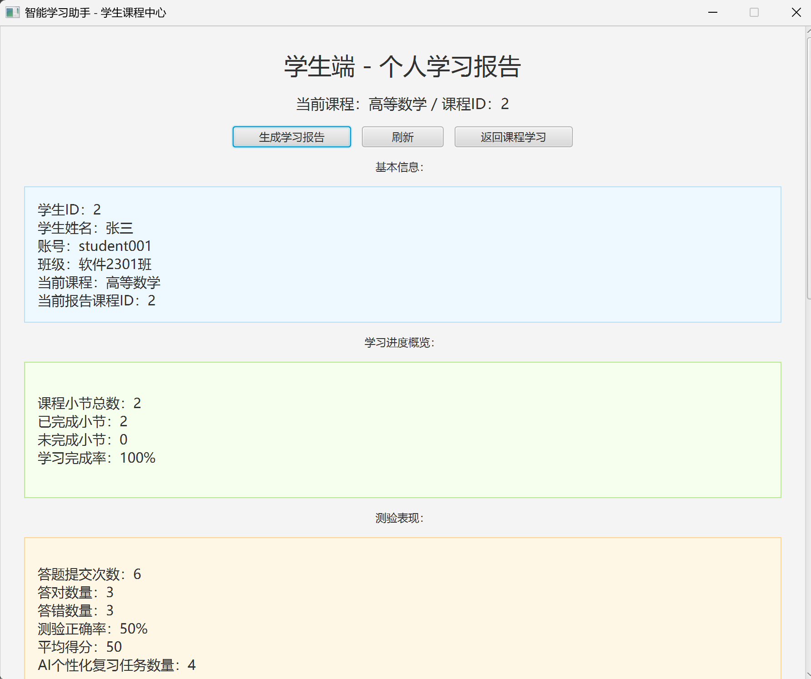

### 13. 教师班级报告页面
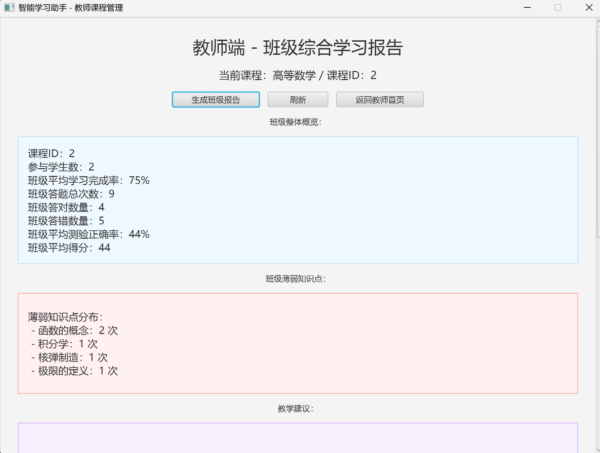

---

## 二十一、作者说明

本项目为智能教学辅助系统实践项目，主要用于展示 Java 后端开发、JavaFX 桌面客户端开发、MySQL 数据库设计、RESTful API 接口设计以及 AI 大模型应用能力。

项目仍在持续完善中，当前版本已经实现了从课程学习、题目任务、答题记录、错题分析到学习报告和 AI 辅助复习的主要功能链路。

---

## 二十二、许可证

本项目主要用于课程设计、学习实践和项目展示。

如需用于正式教学或商业场景，请根据实际情况进一步完善：
• 权限控制
• 数据安全
• 异常处理
• 系统部署与运维

© 2026 AI Learning Assistant
版权所有
